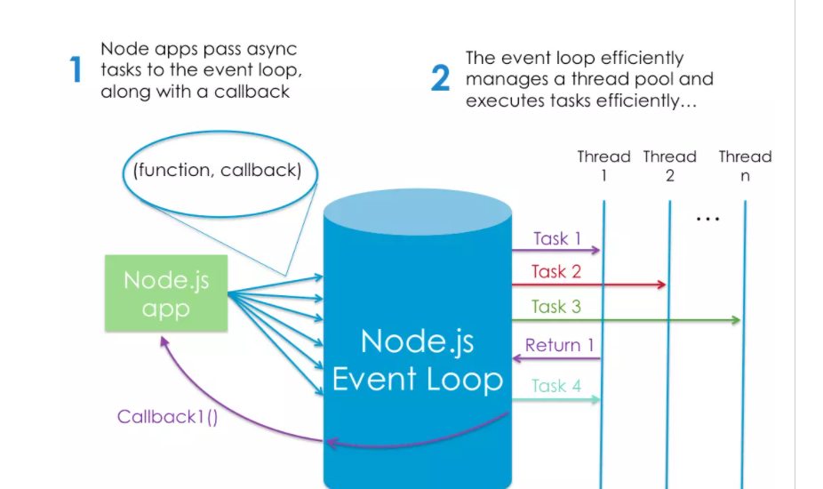

# The V8 engine
 is the open-source JavaScript engine that runs in Google Chrome and other Chromium-based web browsers, including Brave, Opera, and Vivaldi. It was designed with performance in mind and is responsible for compiling JavaScript directly to native machine code that your computer can execute.

# Node Binaries vs Version Manager
Many websites will recommend that you head to the official Node download page and grab the Node binaries for your system. While that works, I would suggest that you use a version manager instead. This is a program that allows you to install multiple versions of Node and switch between them at will. There are various advantages to using a version manager. For example, it negates potential permission issues when using Node with npm and lets you set a Node version on a per-project basis. 

You can check that Node is installed on your system by opening a terminal and typing node -v. If all has gone well, you should see something like v12.14.1 displayed. This is the current LTS version at the time of writing.

Next, create a new file hello.js and copy in the following code:

console.log("Hello, World!");

# Node.js Has Excellent Support for Modern JavaScript
As can be seen on this compatibility table, Node has excellent support for ECMAScript 2015 (ES6) and beyond. As you’re only targeting one runtime (a specific version of the V8 engine), this means that you can write your JavaScript using the latest and most modern syntax. It also means that you don’t generally have to worry about compatibility issues — as you would if you were writing JavaScript that would run in different browsers.

# ntroducing npm, the JavaScript Package Manager
As I mentioned earlier, Node comes bundled with a package manager called npm. To check which version you have installed on your system, type npm -v

# Installing a Package Globally
Open your terminal and type the following:

npm install -g jshint
This will install the jshint package globally on your system. We can use it to lint the index.js file from the previous example:

jshint index.js

Installing a Package Locally
We can also install packages locally to a project, as opposed to globally, on our system. Create a test folder and open a terminal in that directory. Next type this:

npm init -y
This will create and auto-populate a package.json file in the same folder. Next, use npm to install the lodash package and save it as a project dependency:

npm install lodash --save

# Working with the package.json File
If you look at the contents of the test directory, you’ll notice a folder entitled node_modules. This is where npm has saved lodash and any libraries that lodash depends on. The node_modules folder shouldn’t be checked in to version control, and can, in fact, be re-created at any time by running npm install from within the project’s root.

If you open the package.json file, you’ll see lodash listed under the dependencies field. By specifying your project’s dependencies in this way, you allow any developer anywhere to clone your project and use npm to install whatever packages it needs to run.

# What Is Node.js Used For?
Now that we know what Node and npm are and how to install them, we can turn our attention to the first of their common uses: installing (via npm) and running (via Node) various build tools — designed to automate the process of developing a modern JavaScript application.

These build tools come in all shapes and sizes, and you won’t get far in a modern JavaScript landscape without bumping into them. They can be used for anything from bundling your JavaScript files and dependencies into static assets, to running tests, or automatic code linting and style checking.

# The Node.js Execution Model
In very simplistic terms, when you connect to a traditional server, such as Apache, it will spawn a new thread to handle the request. In a language such as PHP or Ruby, any subsequent I/O operations (for example, interacting with a database) block the execution of your code until the operation has completed. That is, the server has to wait for the database lookup to complete before it can move on to processing the result. If new requests come in while this is happening, the server will spawn new threads to deal with them. This is potentially inefficient, as a large number of threads can cause a system to become sluggish — and, in the worst case, for the site to go down. The most common way to support more connections is to add more servers.

# What Kind of Apps Is Node.js Suited To?
Node is particularly suited to building applications that require some form of real-time interaction or collaboration — for example, chat sites, or apps such as CodeShare, where you can watch a document being edited live by someone else. It’s also a good fit for building APIs where you’re handling lots of requests that are I/O driven (such as those needing to perform operations on a database), or for sites involving data streaming, as Node makes it possible to process files while they’re still being uploaded.

# What Are the Advantages of Node.js?
Aside from speed and scalability, an often-touted advantage of using JavaScript on a web server — as well as in the browser — is that your brain no longer needs to switch modes. You can do everything in the same language, which, as a developer, makes you more productive (and hopefully, happier). For example, you can easily share code between the server and the client.

Another of Node’s big pluses is that it speaks JSON. JSON is probably the most important data exchange format on the Web, and the lingua franca for interacting with object databases (such as MongoDB). JSON is ideally suited for consumption by a JavaScript program, meaning that when you’re working with Node, data can flow neatly between layers without the need for reformatting. You can have one syntax from browser to server to database.

