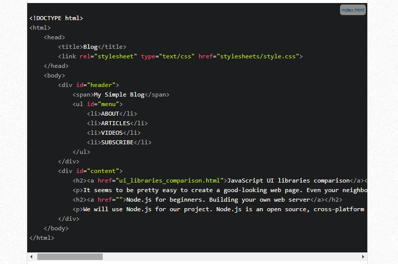

# Node.js 

is an open source, cross-platform runtime environment, which allows you to build server-side and networking applications. It's written in JavaScript and can be run within the Node.js runtime on any platform.

First of all, we need to create a JavaScript file. Let's name it server.js

var http = require("http");

http.createServer(function(request, response) {
  response.writeHead(200, {"Content-Type": "text/plain"});
  response.write("It's alive!");
  response.end();
}).listen(3000);

### It's simple. It's tiny. But it's a server! Let's make sure it's working. Run at your terminal:

node server.js

Well, it is a server! And we have evidence. What you got here is your own client-server model, which can fit in your bag! Take it any place you want! It will be a good idea to deploy our server online, so everyone could see it.

But you should notice something, before we go further. Let's look more closely at our first Node server. This is an example of how Node provides you with non-blocking and event-driven behavior. Let me explain:

$.post('/some_requested_resource', function(data) {
  console.log(data);
});

This code performs a request for some resource. When the response comes back, an anonymous function is called. It contains the argument data, which is the data received from that request.

So, Node allows you to use the so-called event loop, which works faster because of non-blocking behavior. For example, nginx uses an event loop with asynchronous I/O. That's why it's fast as hell!

This is not so hard to understand this conception in outline, so let's move along

Make it worldwide
Works fine. But it works locally. WWW is for "World Wide Web" and we will turn your local server into a world wide server. We'll use Heroku cloud application platform for this. Heroku is a cloud platform as a service (cool long-bearded programmer guys call such type of things "PaaS"). It allows you to deploy your web server, so everyone could see how awesome you are as a web developer. First of all, you need to create an account on developer's site and install Heroku. This is not so hard. Just follow the instructions. There is also instruction on Heroku's site that can explain you how to run your first simple web server, which returns you the "Hello, World!" string. You can try it, but I think that it will be more interesting if we build our own web server from scratch. Sounds exciting, huh?

Look, mom! I'm developing!
### First step after Heroku installation is to log in to the system from your computer:

heroku login

We will leave Heroku for now. But we'll need it soon after we build our server.

Now, the creation. It will be a simple blog with basic functionality. It will show you requested web pages and the error page in case of an error.

## Create your project directory. And then create the server.js file inside of it.

### First of all, let's declare some variables:

var http = require("http");
var fs = require("fs");
var path = require("path");
var mime = require("mime");

### Create the package.json file and fill it with proper information. Here's mine:

package.json
{
  "name" : "blog",
  "version" : "0.0.1",
  "description" : "My minimalistic blog",
  "dependencies" : {
    "mime" : "~1.2.7"
  }
}
There are "name", "version", "description", and "dependencies" fields in it. The syntax is simple, as you can see. We added our "mime" plug-in and now it's time to download it. We'll use built-in Node Package Manager. Just run:

npm install

It will create node_modules folder and place all the files inside of it. So, we resolve our dependencies and can return to our code.

We will now create send404() function. It will handle the sending of 404 error, which usually appears when requested file doesn't exist:

function send404(response) {
  response.writeHead(404, {"Content-type" : "text/plain"});
  response.write("Error 404: resource not found");
  response.end();
}
Nothing sophisticated with this one. It returns plain text when server can't find a page.

Now we will define sendPage() function. It first writes the header and then sends the contents of the file:

function sendPage(response, filePath, fileContents) {
  response.writeHead(200, {"Content-type" : mime.lookup(path.basename(filePath))});
  response.end(fileContents);
}

### Now we'll define how our server will handle responses. This function will return the content of the requested file or the 404 error otherwise:

handler.js
function serverWorking(response, absPath) {
  fs.exists(absPath, function(exists) {
    if (exists) {
      fs.readFile(absPath, function(err, data) {
        if (err) {
          send404(response)
        } else {
          sendPage(response, absPath, data);
        }
      });
    } else {
      send404(response);
    }
  });
}
And now it's time to create the HTTP server:

var server = http.createServer(function(request, response) {
  var filePath = false;

  if (request.url == '/') {
    filePath = "public/index.html";
  } else {
    filePath = "public" + request.url;
  }

  var absPath = "./" + filePath;
  serverWorking(response, absPath);
});

http.createServer(<some code here>).listen(3000)
var port_number = server.listen(process.env.PORT || 3000);

It's Heroku time!
### Open your terminal within your project folder. For my Linux it's:

cd /path/to/my/project
Then run:

git init
Empty Git repository will be initialized in .git/ folder.

Then run:

git add .

Now commit your files to the initialized Git repo:

git commit -m "Simple server functionality added"
We'll create our first Heroku application now:

heroku create
Heroku will generate a random name for your application. In my case it's enigmatic-citadel-9298. Don't worry. You can change it later.

Now we can deploy our project. Every Heroku app starts with no branches and no code. So, the first time we deploy our project, we need to specify a remote branch to push to:

git push heroku master

heroku ps:scale web=1
And now, before we open it, it's time to choose a proper name for our first creation. I called it myfirstserver:

heroku apps:rename myfirstserver
Everything is done. You can try it now:

heroku open 

