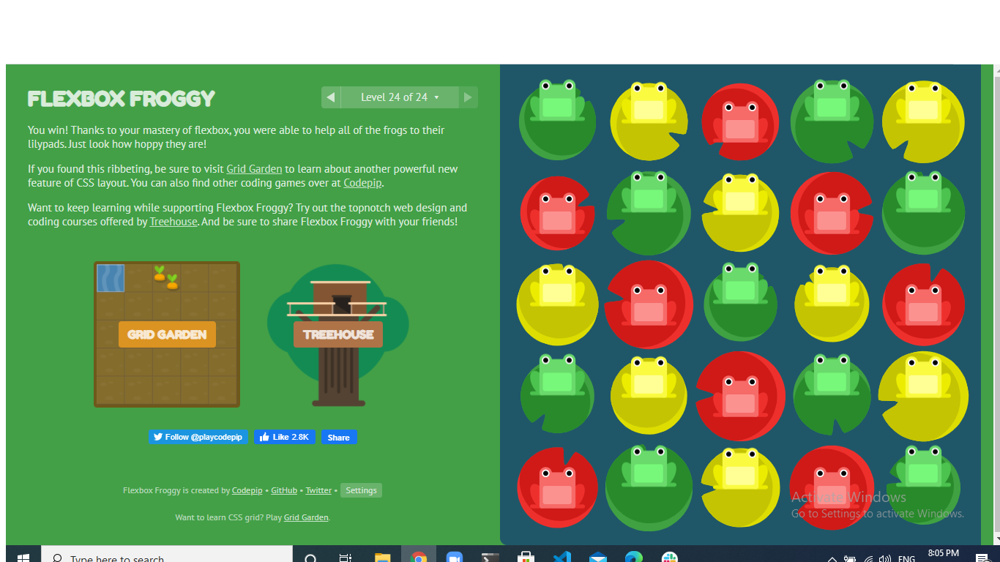

# Javascript Templating
Javascript templating is a fast and efficient technique to render client-side view templates with Javascript by using a JSON data source. The template is HTML markup, with added templating tags that will either insert variables or run programming logic.
The template engine then replaces variables and instances declared in a template file with actual values at runtime, and convert the template into an HTML file sent to the client.

# Mustache
Mustache is a logic-less template syntax. It can be used for HTML, config files, source code — anything. It works by expanding tags in a template using values provided in a hash or object.
It is often referred to as “logic-less” because there are no if statements, else clauses, or for loops. Instead, there are only tags. Some tags are replaced with a value, some nothing, and others a series of values.
mustache.js is an implementation of the mustache template system in JavaScript. It is often considered the base for JavaScript templating. And, since mustache supports various languages, we don’t need a separate templating system on the server side .

Mustache is NOT a templating engine. Mustache is a specification for a templating language. 

# flexbox
Since flexbox is a whole module and not a single property, it involves a lot of things including its whole set of properties. Some of them are meant to be set on the container (parent element, known as “flex container”) whereas the others are meant to be set on the children (said “flex items”).

If “regular” layout is based on both block and inline flow directions, the flex layout is based on “flex-flow directions”. Please have a look at this figure from the specification, explaining the main idea behind the flex layout.

main axis – The main axis of a flex container is the primary axis along which flex items are laid out. Beware, it is not necessarily horizontal; it depends on the flex-direction property (see below).
main-start | main-end – The flex items are placed within the container starting from main-start and going to main-end.
main size – A flex item’s width or height, whichever is in the main dimension, is the item’s main size. The flex item’s main size property is either the ‘width’ or ‘height’ property, whichever is in the main dimension.
cross axis – The axis perpendicular to the main axis is called the cross axis. Its direction depends on the main axis direction.
cross-start | cross-end – Flex lines are filled with items and placed into the container starting on the cross-start side of the flex container and going toward the cross-end side.
cross size – The width or height of a flex item, whichever is in the cross dimension, is the item’s cross size. The cross size property is whichever of ‘width’ or ‘height’ that is in the cross dimension.

- The Flexible Box Layout Module, makes it easier to design flexible responsive layout structure without using float or positioning. 

# The CSS Flexbox Items Properties

align-self	Specifies the alignment for a flex item (overrides the flex container's align-items property)
flex	A shorthand property for the flex-grow, flex-shrink, and the flex-basis properties
flex-basis	Specifies the initial length of a flex item
flex-grow	Specifies how much a flex item will grow relative to the rest of the flex items inside the same container
flex-shrink	Specifies how much a flex item will shrink relative to the rest of the flex items inside the same container
order	Specifies the order of the flex items inside the same container

[flexableFrogy](https://flexboxfroggy.com/)

