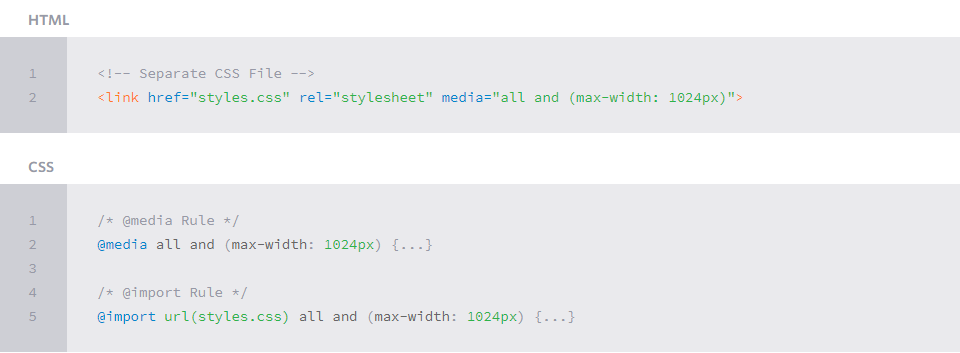

With the growth in mobile Internet usage comes the question of how to build websites suitable for all users. The industry response to this question has become responsive web design, also known as RWD.

# Responsive web design 

Responsive web design is the practice of building a website suitable to work on every device and every screen size, no matter how large or small, mobile or desktop. Responsive web design is focused around providing an intuitive and gratifying experience for everyone. Desktop computer and cell phone users alike all benefit from responsive websites.

Responsive and adaptive web design are closely related, and often transposed as one in the same. Responsive generally means to react quickly and positively to any change, while adaptive means to be easily modified for a new purpose or situation, such as change. With responsive design websites continually and fluidly change based on different factors, such as viewport width, while adaptive websites are built to a group of preset factors. A combination of the two is ideal, providing the perfect formula for functional websites. Which term is used specifically doesn’t make a huge difference

Mobile, on the other hand, generally means to build a separate website commonly on a new domain solely for mobile users. While this does occasionally have its place, it normally isn’t a great idea. Mobile websites can be extremely light but they do come with the dependencies of a new code base and browser sniffing, all of which can become an obstacle for both developers and users.

Currently the most popular technique lies within responsive web design, favoring design that dynamically adapts to different browser and device viewports, changing layout and content along the way. This solution has the benefits of being all three, responsive, adaptive, and mobile.

# Flexible Layouts#flexible-layouts
Responsive web design is broken down into three main components, including flexible layouts, media queries, and flexible media. The first part, flexible layouts, is the practice of building the layout of a website with a flexible grid, capable of dynamically resizing to any width. Flexible grids are built using relative length units, most commonly percentages or em units. These relative lengths are then used to declare common grid property values such as width, margin, or padding.

Flexible layouts do not advocate the use of fixed measurement units, such as pixels or inches. Reason being, the viewport height and width continually change from device to device. Website layouts need to adapt to this change and fixed values have too many constraints. Fortunately, Ethan pointed out an easy formula to help identify the proportions of a flexible layout using relative values.

The formula is based around taking the target width of an element and dividing it by the width of it’s parent element. The result is the relative width of the target element

target ÷ context = result

# Flexible Grid
The goal is to have have the section on the left and the aside on the right, with equal margins between the two. Normally the markup and styles for this layout would look a bit like the following.

The flexible layout approach alone isn’t enough. At times the width of a browser viewport may be so small that even scaling the the layout proportionally will create columns that are too small to effectively display content. Specifically, when the layout gets too small, or too large, text may become illegible and the layout may begin to break. In this event, media queries can be used to help build a better experience

*****************************************************************************************
# Initializing Media Queries
There are a couple different ways to use media queries, using the @media rule inside of an existing style sheet, importing a new style sheet using the @import rule, or by linking to a separate style sheet from within the HTML document. Generally speaking it is recommend to use the @media rule inside of an existing style sheet to avoid any additional HTTP requests. 

Each media query may include a media type followed by one or more expressions. Common media types include all, screen, print, tv, and braille. The HTML5 specification includes new media types, even including 3d-glasses. Should a media type not be specified the media query will default the media type to screen.

The media query expression that follows the media type may include different media features and values, which then allocate to be true or false. When a media feature and value allocate to true, the styles are applied. If the media feature and value allocate to false the styles are ignored.

# Logical Operators in Media Queries
- and
@media all and (min-width: 800px) and (max-width: 1024px) {...}
- not
@media not screen and (color) {...}
- only
@media only screen and (orientation: portrait) {...}

# Media Features in Media Queries
- Height & Width Media Features
@media all and (min-width: 320px) and (max-width: 780px) {...}
- Orientation Media Feature
The orientation media feature determines if a device is in the landscape or portrait orientation. The landscape mode is triggered when the display is wider than taller, and the portrait mode is triggered when the display is taller than wider. This media feature plays a large part with mobile devices.
@media all and (orientation: landscape) {...}
-Aspect Ratio Media Features
The value for the aspect ratio feature consist of two positive integers separated by a forward slash. The first integer identifies the width in pixels while the second integer identifies the height in pixels.
@media all and (min-device-aspect-ratio: 16/9) {...}

# Mobile First#mobile-first
One popular technique with using media queries is called mobile first. The mobile first approach includes using styles targeted at smaller viewports as the default styles for a website, then use media queries to add styles as the viewport grows.

The operating belief behind mobile first design is that a user on a mobile device, commonly using a smaller viewport, shouldn’t have to load the styles for a desktop computer only to have them over written with mobile styles later. Doing so is a waste of bandwidth. Bandwidth that is precious to any users looking for a snappy website.

The mobile first approach also advocates designing with the constraints of a mobile user in mind. Before too long, the majority of Internet consumption will be done on a mobile device. Plan for them accordingly and develop intrinsic mobile experiences.

************************************************************************************************

# What is “Float”?
Float is a CSS positioning property. To understand its purpose and origin, we can look to print design. In a print layout, images may be set into the page such that text wraps around them as needed. 

There are four valid values for the float property. **Left and Right** float elements those directions respectively. **None** (the default) ensures the element will not float and Inherit which will assume the float value from that elements parent element.

# What are floats used for?
Aside from the simple example of wrapping text around images, floats can be used to create entire web layouts.
Floats are also helpful for layout in smaller instances.

# Clearing the Float
Float’s sister property is clear. An element that has the clear property set on it will not move up adjacent to the float like the float desires, but will move itself down past the float.

Clear has four valid values as well. **Both** is most commonly used, which clears floats coming from either direction. **Left and Right** can be used to only clear the float from one direction respectively. None is the default, which is typically unnecessary unless removing a clear value from a cascade. **Inherit** would be the fifth, but is strangely not supported in Internet Explorer. Clearing only the left or right float, while less commonly seen in the wild, definitely has its uses.

# Techniques for Clearing Floats

* The Empty Div Method is, quite literally, an empty div. 

 Sometimes you’ll see a   element or some other random element used, but div is the most common because it has no browser default styling, doesn’t have any special function, and is unlikely to be generically styled with CSS. This method is scorned by semantic purists since its presence has no contextual meaning at all to the page and is there purely for presentation. Of course in the strictest sense, they are right, but it gets the job done right and doesn’t hurt anybody.
* The Overflow Method relies on setting the overflow CSS property on a parent element. If this property is set to auto or hidden on the parent element, the parent will expand to contain the floats, effectively clearing it for succeeding elements. This method can be beautifully semantic as it may not require additional elements. However if you find yourself adding a new div just to apply this, it is equally as non-semantic as the empty div method and less adaptable. Also bear in mind that the overflow property isn’t specifically for clearing floats. Be careful not to hide content or trigger unwanted scrollbars.
* The Easy Clearing Method uses a clever CSS pseudo selector (:after) to clear floats. Rather than setting the overflow on the parent, you apply an additional class like “clearfix” to it

