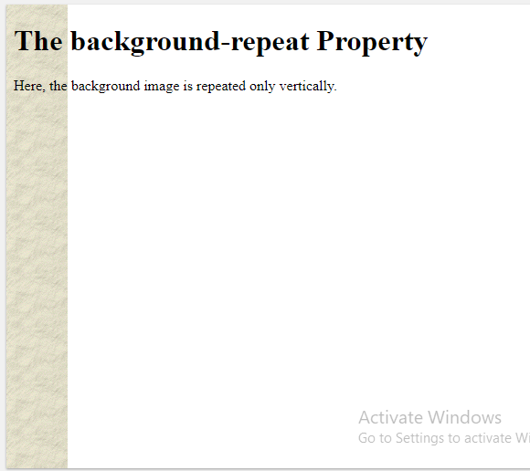
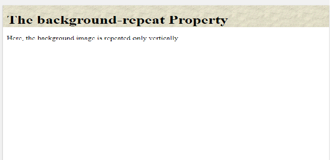

# image 

You can control the size of an image using ( **the width and height** ) properties in CSS, just like you can for any other box .

The **float** property is added to the class that was created to represent the size of the image .

- images are inline elements this means that they flow within the surrounding text. In order to center an image, it should be turned into a blocklevel element using the display property with a value of block.

Once it has been made into a block-level element, there are two common ways in which you can horizontally center an image:
1: On the containing element, you can use the text-align property with a value of center.
2: On the image itself, you can use the use the margin property and set the values of the left and right margins to auto.

img {
  display: block;
  margin-left: auto;
  margin-right: auto;
}

The background-image property allows you to place an image behind any HTML element. This could be the entire
page or just part of the page. By default, a background image will repeat to fill the entire box. 

# Repeating Images

## background-repeat
The background-repeat property can have four values: repeat , repeat-x , repeat-y and no-repeat .

background-repeat: repeat-y;

background-repeat: repeat-x;

## background-attachment
The background-attachment property specifies whether a background image should stay in one position or move as the user scrolls up and down the page. It can have one of two values: fixed , scroll .

# background-position

property to specify where in the browser window the background image should be placed.
This property usually has a pair of values. The first represents the horizontal position and the
second represents the vertical. If you only specify one value, the second value will default to center.

*****************************************************

# Search Engine Optimization (SEO)

* Search engine optimization helps visitors find your sites when using search engines.
* Analytics tools such as Google Analytics allow you to see how many people visit your site, how they find it,
and what they do when they get there.
* To put your site on the web, you will need to obtain a domain name and web hosting.
* FTP programs allow you to transfer files from your local computer to your web server.
* Many companies provide platforms for blogging, email newsletters, e-commerce and other popular website tools (to save you writing them from scratch).

*****************************************************

# HTML5 video and audio

The < video > and < audio > elements allow us to embed video and audio into web pages. 

## The HTMLMediaElement API

Part of the HTML5 spec, the HTMLMediaElement API provides features to allow you to control video and audio players programmatically — for example HTMLMediaElement.play(), HTMLMediaElement.pause(), etc.

*****************************************************
# Flash 

* Flash allows you to add animations, video and audio to
the web.
* Flash is not supported on iPhone or iPad.
* HTML5 introduces new < video > and < audio > elements for adding video and audio to web pages, but these are only supported in the latest browsers.

