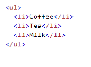
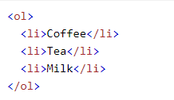
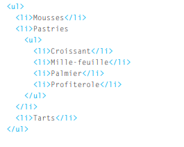

# HTML lists 

1. < ol > The ordered list is created with the ol element.
< li > Each item in the list is placed between an opening li tag and a closing li tag

2. < ul > The unordered list is created with the < ul > element.
< li > Each item in the list is placed between an opening li tag and a closing </ li >tag(The listands for list item.)

# HTML Description Lists

* The definition list is created with the < dl > element and usually consists of a series of terms and their definitions.
Inside the < dl > element you will usually see pairs of < dt > and < dd > elements.
The < dl > tag defines the description list, the < dt > tag defines the term (name), and the < dd > tag describes each term

* You can put a second list inside an < li > element to create a sublist or nested list.

************************************************
# box dimensions

You can use CSS to control the dimensions of a box To set your own dimensions for a box you can use the height and width properties .

- min-width: 450px
- max-width: 650px
- min-height: 10px;
- max-height: 30px;

# CSS overflow Property

This property specifies whether to clip content or to add scrollbars when an element's content is too big to fit in a specified area
Note: The overflow property only works for block elements with a specified height.

- overflow: hidden;
- overflow: scroll;

* You can also control the borders, margin and padding for each box with CSS.

# CSS Border Properties

The CSS border properties allow you to specify the style, width, and color of an element's border.
- border-width: 2px;
- border-style: solid;
- border-style: dotted;
- border-color: #0088dd;

# CSS Padding

The CSS padding properties are used to generate space around an element's content, inside of any defined borders. 
padding-top: 50px;
padding-right: 30px;
padding-bottom: 50px;
padding-left: 80px;

# CSS Margins

The CSS margin properties are used to create space around elements, outside of any defined borders.

margin-top: 100px;
margin-bottom: 100px;
margin-right: 150px;
margin-left: 80px;

## CSS display Property

The display property specifies the display behavior (the type of rendering box) of an element.

***********************************************

# ARRAYS 

An array is a special type of variable. It doesn't just store one value; it stores a list of values. 
Values in an array are accessed as if they are in a numbered list. It is important to know that the numbering of this list starts at zero (not one).

var colors = new Array('white ' ,'black','custom')
* to  Update the third item in the array
colors[2] = 'beige ' 

*************************************

Conditional statements allow your code to make decisions about what to do next. 

## IF ... ELSE STATEMENTS  
if ... e 1 se statement allows you to provide two sets of code:

1. one set if the condition evaluates to true
2. another set if the condition is false 

* Comparison operators (===, ! ==, ==, ! =, <, >, <=, =>) are used to compare two operands

* A switch statement starts with a variable called the switch value. Each case indicates a possible value for this variable and the
code that should run if the variable matches that value. 

* There are three types of loop: for, while, and do ... while. Each repeats a set of statements. 
* A for loop is often used to loop through the items in an array.

*************************************************************************** 
