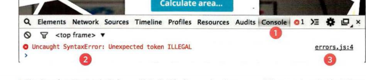

# EXECUTION CONTEXTS

The JavaScript interpreter uses the concept of execution contexts.There is one global execution context; plus, each function creates a new new execution contex t. They correspond to variable scope.

If a JavaScript statement generates an error, then it throws an exception . At that point, the interpreter stops and looks for exception-handl ing code .

**Error objects** can help you find where your mistakes are and browsers have tools to help you read them.

## HOW TO DEAL WITH ERRORS

1: DEBUG THE SCRIPT TO FIX ERRORS
2: HANDLE ERRORS GRACEFULLY (You can handle errors gracefully using try, catch, throw, and f i na 1 ly statements. )

**Debugging** is about deduction: eliminating potential causes of an error is the process of finding errors.

## HOW TO LOOK AT ERRORS IN CHROME

The console will show you when there is an error in your JavaScript. It also displays the line where it became a problem for the interpreter. so you can try to find the exact error.

if you get an error, you can handle it gracefully using the try, catch, finally statements.

