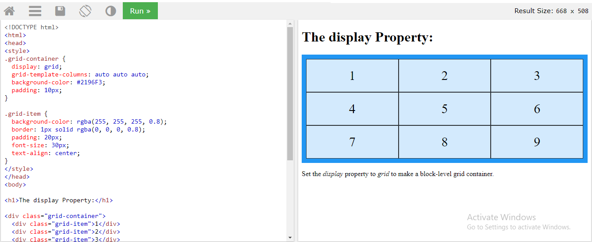
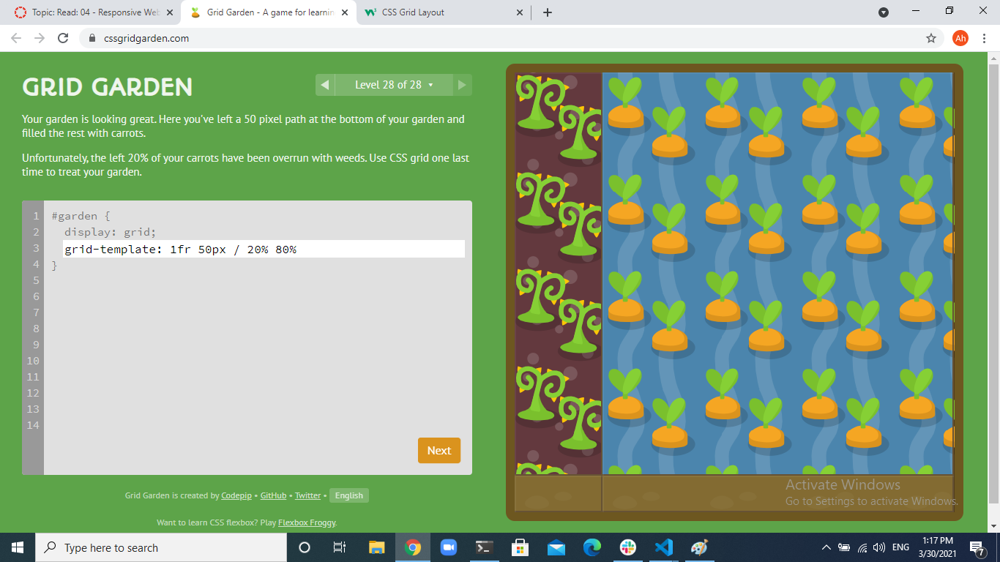

# Regular expressions

(regex or regexp) are extremely useful in extracting information from any text by searching for one or more matches of a specific search pattern

Fields of application range from validation to parsing/replacing strings, passing through translating data to other formats and web scraping.

^The        matches any string that starts with The 
end$        matches a string that ends with end
^The end$   exact string match (starts and ends with The end)
roar        matches any string that has the text roar in it

abc*        matches a string that has ab followed by zero or more c 
abc+        matches a string that has ab followed by one or more c
abc?        matches a string that has ab followed by zero or one c
abc{2}      matches a string that has ab followed by 2 c
abc{2,}     matches a string that has ab followed by 2 or more c
abc{2,5}    matches a string that has ab followed by 2 up to 5 c
a(bc)*      matches a string that has a followed by zero or more copies of the sequence bc
a(bc){2,5}  matches a string that has a followed by 2 up to 5 copies of the sequence bc

a(b|c)     matches a string that has a followed by b or c (and captures b or c) 
a[bc]      same as previous, but without capturing b or c

As you’ve seen, the application fields of regex can be multiple and I’m sure that you’ve recognized at least one of these tasks among those seen in your developer career, here a quick list:

- data validation (for example check if a time string i well-formed)
- data scraping (especially web scraping, find all pages that contain a certain set of words eventually in a specific order)
- data wrangling (transform data from “raw” to another format)
- string parsing (for example catch all URL GET parameters, capture text inside a set of parenthesis)
- string replacement (for example, even during a code session using a common IDE to translate a Java or C# class in the respective JSON object — replace “;” with “,” make it lowercase, avoid type declaration, etc.)
- syntax highlightning, file renaming, packet sniffing and many other applications involving strings (where data need not be textual)

# Grid 

CSS Grid Layout (aka “Grid”), is a two-dimensional grid-based layout system that aims to do nothing less than completely change the way we design grid-based user interfaces. CSS has always been used to lay out our web pages, but it’s never done a very good job of it. First, we used tables, then floats, positioning and inline-block, but all of these methods were essentially hacks and left out a lot of important functionality (vertical centering, for instance). Flexbox helped out, but it’s intended for simpler one-dimensional layouts, not complex two-dimensional ones (Flexbox and Grid actually work very well together). Grid is the very first CSS module created specifically to solve the layout problems we’ve all been hacking our way around for as long as we’ve been making websites

To get started you have to define a container element as a grid with display: grid, set the column and row sizes with grid-template-columns and grid-template-rows, and then place its child elements into the grid with grid-column and grid-row. Similarly to flexbox, the source order of the grid items doesn’t matter. Your CSS can place them in any order, which makes it super easy to rearrange your grid with media queries. Imagine defining the layout of your entire page, and then completely rearranging it to accommodate a different screen width all with only a couple lines of CSS. Grid is one of the most powerful CSS modules ever introduced.
# Grid Container

## display
Defines the element as a grid container and establishes a new grid formatting context for its contents.

Values:

grid – generates a block-level grid
inline-grid – generates an inline-level grid

## grid-template-columns
## grid-template-rows
Defines the columns and rows of the grid with a space-separated list of values. The values represent the track size, and the space between them represents the grid line.

Values:

<track-size> – can be a length, a percentage, or a fraction of the free space in the grid (using the fr unit)
<line-name> – an arbitrary name of your choosing

[grid garden](https://cssgridgarden.com/)

