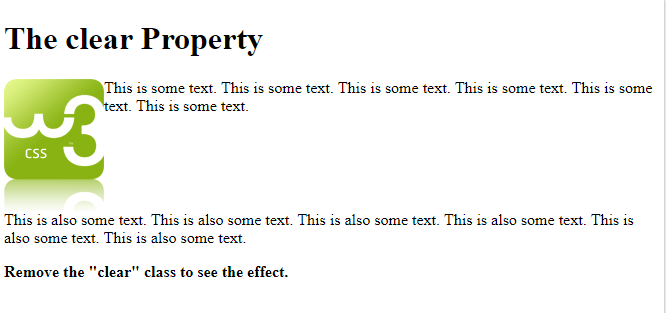

# Writing Links in HTML

Links are created using the < a > element. Users can click on anything between the opening < a > tag and the closing < /a > tag. You specify which page you want to link to using the href attribute.

< a href="http://www.imdb.com">IMDB< /a >

The value of the href attribute is the page that you want people to go to when they click on the link.

## how can i Linking to Other Pages on the Same Site

< a href="index.html">Home</a > 
If all the pages of the site are in the same folder, then the value of the href attribute is just the name of the file.

## Opening Links in a New Window

If you want a link to open in a new window, you can use the **target** attribute on the opening < a > tag. The value of this attribute should be **_blank**

< a href="http://www.imdb.com" target="_blank" >

### Email Links

To create a link that starts up the user's email program and addresses an email to a specified email address value of the href attribute starts
with mailto: and is followed by the email address you want the email to be sent to.

* If you are linking to a page within your own site, it is best to use relative links rather than qualified URLs.
* you can use the id attribute to target elements within a page that can be linked to. 

### Linking to a Specific Part of the Same Page
you might want to add a link from part way down the page back to the top of it to save users from having to scroll back to the top. so You do this using the id attribute.that identify the
sections of the page.so t the value of the href attribute starts with the # symbol, followed by the value of the id attribute of the element you want to link to < a href="#top" >

### Linking to a Specific Part of Another Page
if you want to link to a specific part of a different page (whether on your own site or a different website) you can use a similar technique .
the href attribute will contain the address for the page (either an absolute URL or a relative URL), followed by the # symbol, followed by the value of the id attribute .

 ***************************************************

# Block-level elements
start on a new line Examples include: < h1 > < p > < ul > < li >

# Inline elements
flow in between surrounding text Examples include: < img > < b > < i >

## Containing Elements
A box may be nested inside several other block-level elements. The containing element is always the direct parent of that element.

- CSS has the following positioning schemes that allow you to control the layout of a page: normal flow, relative positioning, and absolute positioning. You specify the positioning scheme using the position
property in CSS. You can also float elements using the float property.
- To indicate where a box should be positioned, you may also need to use **box offset properties** to tell the browser how far from the top or bottom and left or right it should be placed. (You will meet these when we
introduce the positioning schemes on the following pages.)
- When you move any element from normal flow, boxes can overlap. The **z-index property** allows you to control which box appears on top.
-The position property specifies the type of positioning method used for an element (static, relative, absolute, fixed, or sticky).

-The **float property** allows you to take an element in normal flow and place it as far to the left or right of the containing element as possible.
< style >
img {
  float: right;
}
< /style >

-The **clear property** allows you to say that no element (within the same containing element) should touch the left or righthand sides of a box. 

p.clear {
  clear: both;
}

*********************************************************
# fuction 

Functions let you group a series of statements together to perform a specific task. If different parts of a script repeat the same task, you can reuse the function (rather than repeating the same set of statements). 

## declaring it

function myFunction() {
  var carName = "Volvo";
 
}

## call it 

myFunction();

- other example

var x = myFunction(4, 3);   // Function is called, return value will end up in x

function myFunction(a, b) {
  return a * b;             // Function returns the product of a and b
}

## variable's scope
The location where you declare a variable will affect where it can be used within your code. If you declare it within a function, it can only be used within that function. This is known as the variable's scope. 
* LOCAL VARIABLES When a variable is created inside a function using the var keyword, it can only be used in that function.
* GLOBAL VARIABLES If you create a variable outside of a function, then it can be used anywhere within the script.

****************************************************************
# pair programming

pair programming commonly involves two roles: the Driver and the Navigator.

* **The Driver** is the programmer who is typing and the only one whose hands are on the keyboard manages the text editor, switching files, version control, and—of course writing—code
* **The Navigator** uses their words to guide the Driver but does not provide any direct input to the computer thinks about the big picture, what comes next, how an algorithm might be converted in to code 

- Pair programming touches on all four skills: developers explain out loud what the code should do, listen to others’ guidance, read code that others have written, and write code themselves.

1. Greater efficiency
pair programming takes a lot longer and is less efficient. In reality, when two people focus on the same code base, it is easier to catch mistakes in the making. Research indicates that pair programing takes slightly longer, but produces higher-quality code 

2. Engaged collaboration
When two programmers focus on the same code, the experience is more engaging and both programmers are more focused than if they were working alone.Another important aspect of learning to program is knowing when to ask for help

3. Learning from fellow students

4. Social skills
Pair programming is great for improving social skills. When working with someone who has a different coding style, communication is key. This can become more difficult when two programmers have different personalities. Pair programming not only improves programming skills, but can also help programmers develop their interpersonal skills.

5. Job interview readiness
A common step in many interview processes involves pair programming between a current employee and an applicant, either in person or through a shared screen. They will carry out exercises together, such as code challenges, building a project or feature, or debugging an existing code base. By doing so, companies can get a better feel for how an applicant will fit into the team and their collaboration style.

6. Work environment readiness
Many companies that utilize pair programing expect to train fresh hires from CS-degree programs on how they operate to actually deliver a product. Code Fellows graduates who are already familiar with how pairing works can hit the ground running at a new job, with one less hurdle to overcome.

***********************************************************************************************

