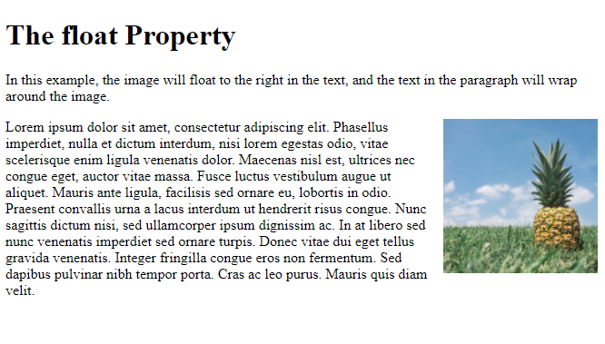

# Block-level elements
start on a new line Examples include: < h1 > < p > < ul > < li >

# Inline elements
flow in between surrounding text Examples include: < img > < b > < i >

## Containing Elements
A box may be nested inside several other block-level elements. The containing element is always the direct parent of that element.

- CSS has the following positioning schemes that allow you to control the layout of a page: normal flow, relative positioning, and absolute positioning. You specify the positioning scheme using the position
property in CSS. You can also float elements using the float property.
- To indicate where a box should be positioned, you may also need to use **box offset properties** to tell the browser how far from the top or bottom and left or right it should be placed. (You will meet these when we
introduce the positioning schemes on the following pages.)
- When you move any element from normal flow, boxes can overlap. The **z-index property** allows you to control which box appears on top.
-The position property specifies the type of positioning method used for an element (static, relative, absolute, fixed, or sticky).

-The **float property** allows you to take an element in normal flow and place it as far to the left or right of the containing element as possible.
< style >
img {
  float: right;
}
< /style >

-The **clear property** allows you to say that no element (within the same containing element) should touch the left or righthand sides of a box. 

p.clear {
  clear: both;
}

- Different visitors to your site will have different sized screens that show different amounts of information, so your design needs to be able to work on a range of different sized screens.

- Resolution refers to the number of dots a screen shows per inch. Some devices have a higher resolution than desktop computers and most operating systems allow users to adjust the resolution of their screens.

- Because screen sizes and display resolutions vary so much, web designers often try to create pages of around 960-1000 pixels wide (since most users will be able to see designs this wide on their screens).

- Because screen sizes and display resolutions vary so much, web designers often try to create pages of around 960-1000 pixels wide (since most users will be able to see designs this wide on their screens).

- Liquid layout designs stretch and contract as the user increases or decreases the size of their browser
window. They tend to use percentages

