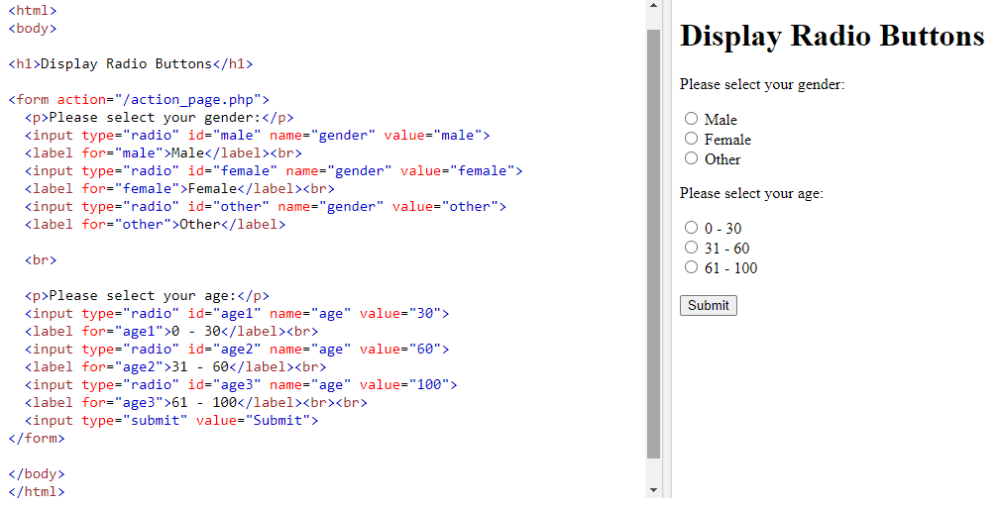
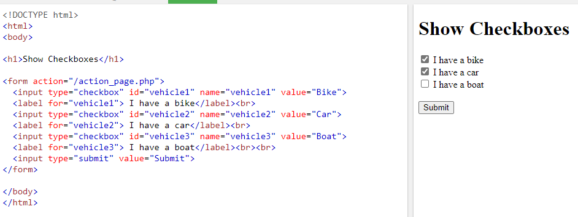
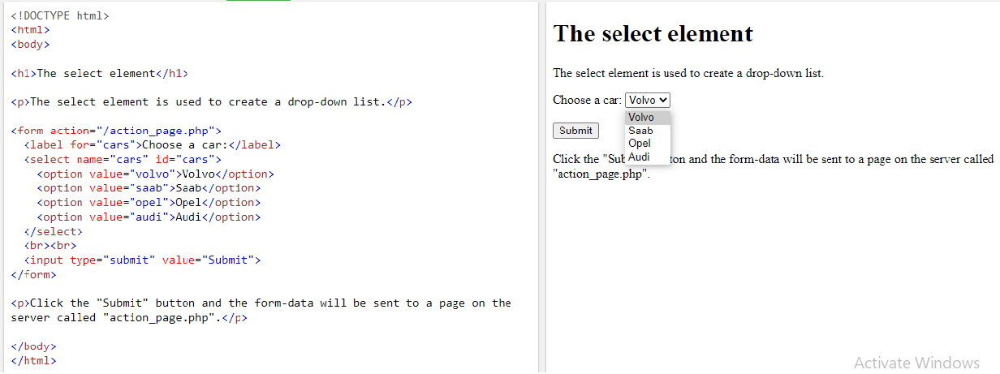

# form

Whenever you want to collect information from visitors you will need a form, which lives inside a < form > element.

- < form > Form controls live inside a < form > element. This element should always carry the action attribute and will usually have a method and id attribute too

- action Every < form > element requires an action attribute. Its value is the URL for the page on the server that will receive the information in the form when it
is submitted.

- method Forms can be sent using one of two methods: get or post.
- < input > element is used to create several different form controls. The value of the type attribute determines what kind of input they will be creating.

- name When users enter information into a form, the server needs to know which form control each piece of data was entered into.
(For example, in a login form, the server needs to know what has been entered as the username and what has been given as the password.)

- type="text" When the type attribute has a value of text, it creates a singleline text input.

- type="password" When the type attribute has a value of password it creates a text box that acts just like a single-line text input, except the characters are blocked out.
They are hidden in this way so that if someone is looking over the user's shoulder, they cannot see sensitive data such as passwords.

- The < textarea > element is used to create a mutli-line text input.

- type="radio" Radio buttons allow users to pick just one of a number of options (name , value , checked ).

- type="checkbox" Checkboxes allow users to select (and unselect) one or more options in answer to a question.

## Drop Down List Box

A drop down list box (also known as a select box) allows users to select one option from a drop down list. 

- The < select > element is used to create a drop down list box. It contains two or more <option> elements.
- The < option > element is used to specify the options that the user can select from. The words between the opening < option > and closing < /option > tags will be shown to the user in the drop
down box.

- The list-style-type property allows you to control the shape or style of a bullet point (also known as a marker) List markers can be given different appearances
using the list-style-type and list-style image properties.
- You can specify an image to act as a bullet point using the list-style-image property.
- the list-styleposition property indicates whether the marker should appear on the inside or the outside of the box containing the main points.
- Table cells can have different borders and spacing in different browsers, but there are properties you can use to control them and make them more consistent. 

***********************************************
# Events

- Events are the browser's way of indicating when something has happened (such as when a page has finished loading or a button has been clicked).

-  The load event is commonly used to trigger scripts that access the contents of the page. 

