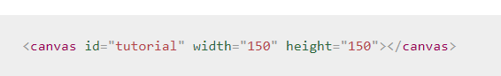
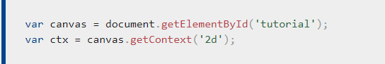
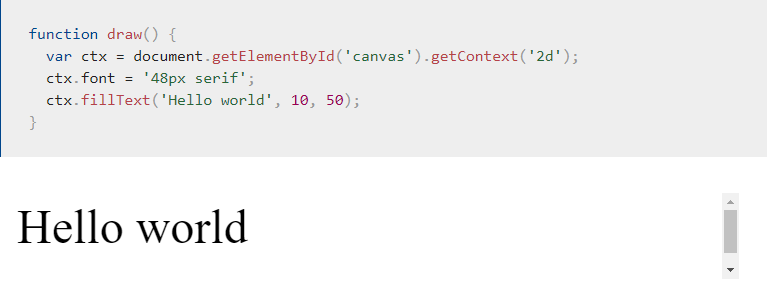
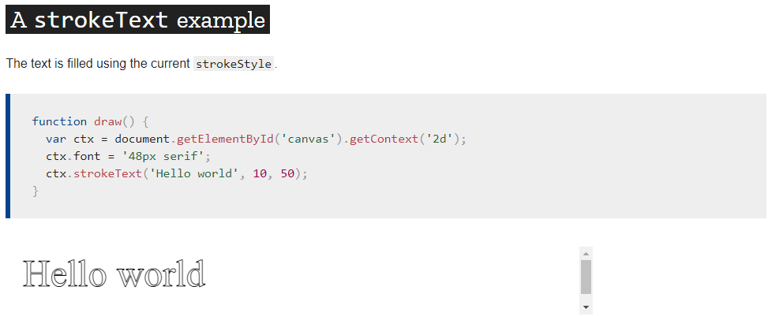

# Charts
Charts are far better for displaying data visually than tables and have the added benefit that no one is ever going to press-gang them into use as a layout tool.

A great way to get started with charts is with Chart.js, a JavaScript plugin that uses HTML5’s canvas element to draw the graph onto the page. It’s a well documented plugin that makes using all kinds of bar charts, line charts, pie charts and more, incredibly easy.

1. The first thing we need to do is download Chart.js. Copy the Chart.min.js out of the unzipped folder and into the directory you’ll be working in .
import the script in the HTML page 
< script src='Chart.min.js'></ script >

To see how to use chart.js we’re going to create a set of 3 graphs; one will show the number of buyers a fictional product has over the course of 6 months, this will be a line chart; the second will show which countries the customers come from, this will be the pie chart; finally we’ll use a bar chart to show profit over the period. 

[chart]("https://www.webdesignerdepot.com/2013/11/easily-create-stunning-animated-charts-with-chart-js/")

****************************************************************

# The < canvas > element

- the < canvas > element has only two attributes, **width and height**. These are both optional and can also be set using DOM properties.
- The < canvas > element can be styled just like any normal image ( margin , border , background… )

- Providing fallback content is very straightforward: just insert the alternate content inside the < canvas > element. Browsers that don't support < canvas> will ignore the container and render the fallback content inside it. Browsers that do support < canvas > will ignore the content inside the container, and just render the canvas normally.

- the < canvas> element requires the closing tag (< /canvas>).

- The canvas is initially blank. To display something, a script first needs to access the rendering context and draw on it. The < canvas > element has a method called getContext(), used to obtain the rendering context and its drawing functions. getContext() takes one parameter, the type of context. For 2D graphics,

*************************************************************

# Colors

If we want to apply colors to a shape, there are two important properties we can use: fillStyle and strokeStyle.

- fillStyle = color
Sets the style used when filling shapes.
- strokeStyle = color
Sets the style for shapes' outlines.

# Transparency
In addition to drawing opaque shapes to the canvas, we can also draw semi-transparent (or translucent) shapes. This is done by either setting the globalAlpha property or by assigning a semi-transparent color to the stroke and/or fill style.

globalAlpha = transparencyValue

# Line styles

There are several properties which allow us to style lines.

- lineWidth = value
Sets the width of lines drawn in the future.
- lineCap = type
Sets the appearance of the ends of lines.
- lineJoin = type
Sets the appearance of the "corners" where lines meet.
- miterLimit = value
Establishes a limit on the miter when two lines join at a sharp angle, to let you control how thick the junction becomes.
- getLineDash()
Returns the current line dash pattern array containing an even number of non-negative numbers.
- setLineDash(segments)
Sets the current line dash pattern.
- lineDashOffset = value
Specifies where to start a dash array on a line.

*********************************************************

# Drawing text

*fillText(text, x, y [, maxWidth])*
Fills a given text at the given (x,y) position. Optionally with a maximum width to draw.

*strokeText(text, x, y [, maxWidth])*
Strokes a given text at the given (x,y) position. Optionally with a maximum width to draw.

## Styling text

- font = value
- textAlign = value
- textBaseline = value
- direction = value

