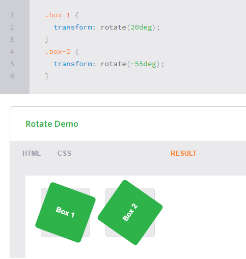
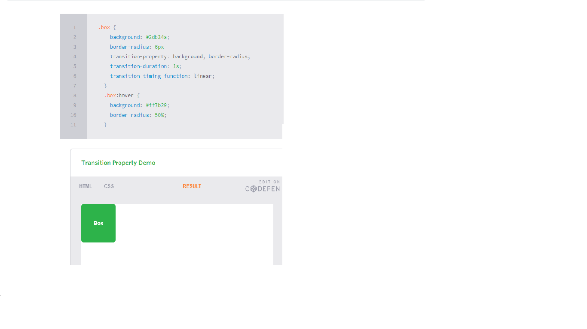

# Transforms

With CSS3 came new ways to position and alter elements. Now general layout techniques can be revisited with alternative ways to size, position, and change elements. All of these new techniques are made possible by the transform property.

The transform property comes in two different settings, two-dimensional and three-dimensional. Each of these come with their own individual properties and values.

## 2D Transforms#two-dimensional-transforms

Elements may be distorted, or transformed, on both a two-dimensional plane or a three-dimensional plane. Two-dimensional transforms work on the x and y axes, known as horizontal and vertical axes. Three-dimensional transforms work on both the x and y axes, as well as the z axis. These three-dimensional transforms help define not only the length and width of an element, but also the depth. We’ll start by discussing how to transform elements on a two-dimensional plan

- The transform property accepts a handful of different values. The rotate value provides the ability to rotate an element from 0 to 360 degrees. Using a positive value will rotate an element clockwise, and using a negative value will rotate the element counterclockwise. The default point of rotation is the center of the element, 50% 50%, both horizontally and vertically .

- Using the scale value within the transform property allows you to change the appeared size of an element. The default scale value is 1, therefore any value between .99 and .01 makes an element appear smaller while any value greater than or equal to 1.01 makes an element appear larger.

- The translate value works a bit like that of relative positioning, pushing and pulling an element in different directions without interrupting the normal flow of the document. Using the translateX value will change the position of an element on the horizontal axis while using the translateY value will change the position of an element on the vertical axis.

- The transform-origin property can accept one or two values. When only one value is specified, that value is used for both the horizontal and vertical axes. If two values are specified, the first is used for the horizontal axis and the second is used for the vertical axis.

# 3D Transforms

Working with two-dimensional transforms we are able to alter elements on the horizontal and vertical axes, however there is another axis along which we can transform elements. Using three-dimensional transforms we can change elements on the z axis, giving us control of depth as well as length and width.

- Using the rotateX value allows you to rotate an element around the x axis, as if it were being bent in half horizontally. Using the rotateY value allows you to rotate an element around the y axis, as if it were being bent in half vertically. Lastly, using the rotateZ value allows an element to be rotated around the z axis.

- scaleZ three-dimensional transform elements may be scaled on the z axis. This isn’t extremely exciting when no other three-dimensional transforms are in place, as there is nothing in particular to scale. 

# Transitions

for a transition to take place, an element must have a change in state, and different styles must be identified for each state. The easiest way for determining styles for different states is by using the :hover, :focus, :active, and :target pseudo-classes.
There are four transition related properties in total, including transition-property, transition-duration, transition-timing-function, and transition-delay. Not all of these are required to build a transition .

- The transition-property property determines exactly what properties will be altered in conjunction with the other transitional properties .

- The duration in which a transition takes place is set using the transition-duration property. The value of this property can be set using general timing values, including seconds (s) and milliseconds (ms) .

# Animations

-  The @keyframes rule includes the animation name, any animation breakpoints, and the properties intended to be animated.
- On top of being able to set the number of times an animation repeats, you may also declare the direction an animation completes using the animation-direction property. Values for the animation-direction property include normal, reverse, alternate, and alternate-reverse .

